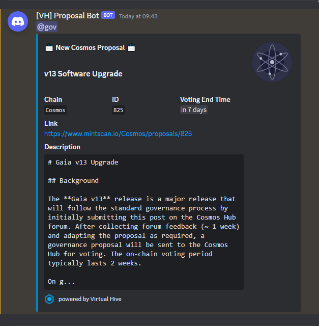

# Discord Proposal Notifier
Notifies about new proposals of cosmos-sdk chains via Discord webhook

## Configure & Run

1. Clone the repo

    `git clone https://github.com/virtualhive/discord-proposal-notifier.git`

2. Configure for the chain you want to monitor

    Open the proposal-notifier.py script and replace the constants at the beginning of the file

    |Constant|Example Value|Description|
    |---|---|---|
    |BOT_NAME|\[VH\] Proposal Bot|Display name in Discord|
    |PING|<@&123456789>|The role or person you want to ping in Discord|
    |THUMBNAIL|https://raw.githubusercontent.com/cosmos/chain-registry/master/cosmoshub/images/atom.png|Image displayed with the Discord message|
    |DISCORD_WEBHOOK_URL|https://discord.com/api/webhooks/123/abcde...|URL of the Discord webhook|
    |REST_API_URL|https://rest.cosmos.directory/cosmoshub|URL of the REST api endpoint of the chain you want to monitor|
    |CHAIN_NAME|Cosmos|Mintscan-compatible name of the chain (see https://www.mintscan.io/ for the names they use in their URLs)|

3. Run with crontab every 4 hours (or choose your own interval):

    `0 */4 * * * python3 /<path-to>/proposal-notifier.py | tee /<path-to>/proposal-notifier.log`

## Preview

Example Notification in Discord:

